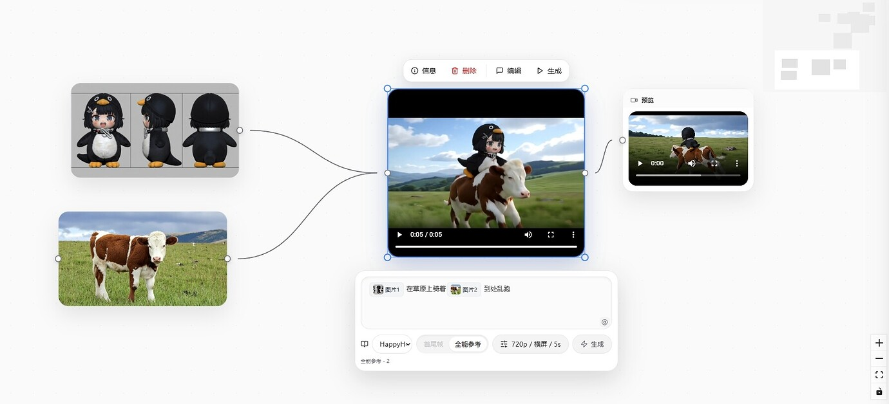
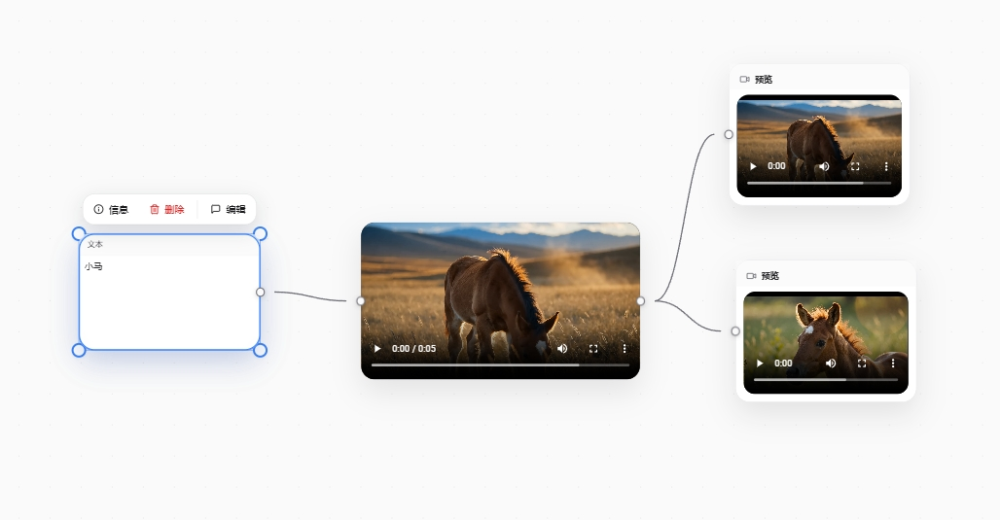

<p align="center">
  
</p>

**节点式 AI 创作画布：把图片、视频、文本生成节点连成可视化工作流**


[官网](https://www.tack2ai.cn/) · [快速开始](#-%E5%BF%AB%E9%80%9F%E5%BC%80%E5%A7%8B) · [截图](#-%E6%88%AA%E5%9B%BE) · [文档](./docs) · [更新日志](./CHANGELOG.md) · [贡献](./CONTRIBUTING.md)

***

## ✨ 特性

* 🎨 **节点式编辑器** — 基于 [@xyflow/react](https://reactflow.dev/) 的可视化工作流画布

* 🤖 **多模型支持** — 兼容 OpenAI、Midjourney、Jimeng、Seedance 等主流接口

* 🎬 **丰富的节点类型** — 文本、图片生成、视频生成、角色/场景、分镜等

* 💾 **自动保存** — IndexedDB 本地持久化，支持撤销/重做

* 🔧 **类型安全** — TypeScript + React 18 + Zustand

* 🧪 **测试完备** — Vitest + MSW 模拟 API

## 🚀 快速开始

### 前置要求

* [Bun](https://bun.sh/) ≥ 1.0（推荐）或 Node.js ≥ 18

### 安装与运行

```bash
git clone https://github.com/tdsoc2002/PinCanvas.git
cd PinCanvas
bun install
bun run dev        # 默认访问 http://127.0.0.1:5173
```

### 配置 API Key

1. 启动后点击右上角 **设置** 按钮

2. 在「服务商配置」中添加你的 API Key 与 Base URL

3. 保存后即可在节点上选择模型生成内容

数据完全保存在浏览器本地（IndexedDB），无需注册账号。

### Docker 部署（可选）

```bash
docker build -t pincanvas .
docker run -p 8080:80 pincanvas
# 访问 http://localhost:8080
```

如需开启对象存储（上传图片/视频到云端），复制并填写配置：

```bash
cp server/config.example.json server/config.local.json
# 编辑 server/config.local.json 填入 S3 兼容凭证
```

支持任意 S3 兼容对象存储（AWS S3、Cloudflare R2、火山引擎 TOS、阿里云 OSS、MinIO 等）。

## 🔌 接入新的 API 服务商 / 模型

PinCanvas 通过 **OpenAI 兼容协议** 与上游 AI 服务交互。绝大多数 AI 网关（OpenAI、Anthropic 代理、火山方舟、阿里百炼、自部署 Ollama / vLLM 等）都遵循这个协议，配置 baseUrl + apiKey 即可工作。

### 方式 1：通过 UI 配置（无需改代码，推荐）

适合：使用 OpenAI 兼容协议的服务商、个人按需添加模型。

1. 点击右上角 **设置 → 服务商配置**

2. 点击「新增服务商」，填写：

   * **服务商名称**：自定义，例如 `OpenRouter`

   * **Base URL**：服务商的 API 网关，例如 `https://openrouter.ai/api`

   * **API Key**：你的密钥

3. 切换到 **模型管理** 标签，点击「新增模型」：

   * **模型 ID**：必须与服务商 API 接受的 model 字段一致（例如 `anthropic/claude-3.5-sonnet`）

   * **模态**：image / video / chat

   * **关联服务商**：选刚才添加的服务商

4. 保存后即可在节点上选择新模型

### 方式 2：通过代码扩展（需要改代码）

适合：服务商有特殊路由规则、需要内置默认模型、想贡献给上游仓库。

需要修改的位置：

| 任务            | 文件                                  | 改动内容                                             |
| ------------- | ----------------------------------- | ------------------------------------------------ |
| 新增内置模型        | `src/api/models.ts`                 | 在 `DEFAULT_MODELS` 数组追加 `ModelDef`               |
| 新增服务商枚举       | `src/types/model.ts`                | 在 `Provider` 联合类型加新值                             |
| 自定义路由规则       | `src/api/model-routing.ts`          | 在 `routeImage` / `routeVideo` / `routeChat` 增加分支 |
| 非 OpenAI 协议适配 | `src/api/<provider>.ts`             | 新建文件，导出请求函数（参考 `midjourney.ts` / `seedance.ts`）  |
| 接入完整链路        | `src/hooks/useGenerationTrigger.ts` | 在 dispatch 链路接上新 provider                        |

**最小改动示例：添加一个 OpenAI 兼容的新图片模型**

```ts
// src/api/models.ts
{
  id: 'flux-pro-1.1',
  name: 'flux-pro-1.1',
  provider: 'openai',           // OpenAI 兼容协议 → 复用现有逻辑
  modality: 'image',
  ratios: ['1:1', '16:9', '9:16'],
  resolutions: ['1024x1024', '2048x2048'],
  group: 'Flux',
},
```

只加这一项，新模型就会出现在下拉菜单中并立即可用。

详细的类型定义见 `docs/node-types.md` 与 `docs/model-routing.md`。

### 方式 3：用 AI 帮你改代码

如果你不熟悉 TypeScript 也想快速接入新模型，可以让 [Claude Code](https://claude.com/claude-code)、[Cursor](https://cursor.com)、[GitHub Copilot](https://github.com/features/copilot) 等 AI 编程助手代劳。

**推荐 prompt 模板**（直接复制粘贴并替换 `<...>` 占位）：

```text
帮我在 PinCanvas 项目中接入 <服务商名称> 的 <模型 ID> 模型。

服务商信息：
- 协议：OpenAI 兼容 / 自定义 REST（请选一）
- Base URL：<填入 https://...>
- 文档：<填入官方文档链接>
- 模型 ID（API 接收的值）：<填入>
- 模态：image / video / chat
- 特殊参数：<例如支持图生图、需要异步轮询、支持的分辨率等>

请：
1. 在 src/api/models.ts 的 DEFAULT_MODELS 中追加 ModelDef
2. 如果协议不是 OpenAI 兼容，在 src/api/ 下新建适配文件
3. 必要时在 src/api/model-routing.ts 增加路由分支
4. 在 src/types/model.ts 的 Provider 联合类型加新值（如果是新服务商）
5. 改完后跑 bun run typecheck 与 bun run test:run 确认无误
```

**给 AI 的关键上下文文件**（让 AI 提前读过这些可大幅提升准确度）：

* `src/types/model.ts` — ModelDef 与 Provider 类型

* `src/api/models.ts` — 已有模型清单（可作为模板参考）

* `src/api/model-routing.ts` — 路由决策表

* `src/api/upstream.ts` — 默认配置常量

* `docs/api-contract.md` — API 契约规范

* `docs/model-routing.md` — 路由规则详解

* `src/api/seedance.ts` — 自定义协议适配的范例

**最简单的场景**（OpenAI 兼容模型）只需让 AI 改 `src/api/models.ts` 一处即可，30 秒搞定。

> 💡 如果你成功接入了一个公开的新模型，欢迎提交 PR 让更多人受益！

## 📸 截图

### 工作流示例：图生视频 / 图音生视频


下图展示了一个典型的多节点工作流：

* **左上**：用单张图片输入 → 通过 HappyHorse 模型生成 5s 视频

* **左下**：图片 + 音频联合输入 → 通过 doubao-seedance 模型生成带音频的视频

* 节点之间通过连线传递素材，每个节点可独立配置模型、分辨率、时长等参数

### @ 引用参考图（v0.0.1）



在图片生成节点的 prompt 编辑器中输入 `@` 即可从已连接的图片节点中挑选参考图，以卡片形式插入到提示词内（如 `@图片1 在草原上骑着 @图片2 到处乱跑`）。当前支持作为参考图源的节点类型：`input-image`、`gen-image`、`image-compare`、`preview`（图片类型）。

### 文本驱动视频生成



仅用一个文本节点（如「小马」）即可驱动视频生成节点产出多条视频结果，配合 Preview 节点查看每一路输出。

> 💡 想分享你的工作流截图？欢迎提交 PR 添加到本节！

## 🛠️ 开发命令

```bash
bun run dev        # 前端开发服务器
bun run dev:server # 后端服务（可选，用于对象存储）
bun run build      # 生产构建
bun run preview    # 预览生产构建
bun run typecheck  # TypeScript 类型检查
bun run test       # 运行测试
bun run lint       # 代码检查
bun run format     # 代码格式化
```

## 📦 技术栈

| 类别    | 选型                     |
| ----- | ---------------------- |
| 前端框架  | React 18 + TypeScript  |
| 状态管理  | Zustand + Zundo（撤销/重做） |
| 节点编辑器 | @xyflow/react          |
| 样式    | Tailwind CSS           |
| 图标    | Lucide React           |
| 本地存储  | idb-keyval（IndexedDB）  |
| 构建工具  | Vite                   |
| 运行时   | Bun                    |
| 测试    | Vitest + MSW           |

## 📁 项目结构

```text
.
├── docs/                   # 设计文档与图片
├── server/                 # Bun 后端服务（可选，对象存储）
├── public/                 # 静态资源（logo / favicon）
├── src/
│   ├── api/                # API 客户端（OpenAI 兼容 / Midjourney / 等）
│   ├── canvas/             # 节点与连线组件
│   ├── components/         # 通用 UI 组件
│   ├── config/             # 特性开关
│   ├── hooks/              # React Hooks
│   ├── store/              # Zustand 状态
│   ├── types/              # TypeScript 类型
│   └── utils/              # 工具函数
└── Dockerfile
```

## 🔒 安全提示

* ⚠️ **不要在代码中硬编码 API Key**，使用设置面板或 `.env` 文件配置

* ⚠️ **不要通过 URL 传递 API Key**，URL 可能被浏览器历史、CDN、Referer 头泄露

* 敏感配置文件（`.env`、`server/config.local.json`）已默认排除在 git 之外

* 详见 [SECURITY.md](./SECURITY.md)

## 🤝 贡献

欢迎贡献！请先阅读 [CONTRIBUTING.md](./CONTRIBUTING.md)。

* 🐛 **Bug 反馈**: [Issues](https://github.com/tdsoc2002/PinCanvas/issues/new?template=bug_report.yml)

* ✨ **功能建议**: [Issues](https://github.com/tdsoc2002/PinCanvas/issues/new?template=feature_request.yml)

* ❓ **提问求助**: [Issues](https://github.com/tdsoc2002/PinCanvas/issues/new?template=question.yml)

* 💬 **开放讨论**: [Discussions](https://github.com/tdsoc2002/PinCanvas/discussions)

* 🔧 **代码贡献**: 提交 Pull Request

## 💬 社区

* 🌐 **官网**: [tack2ai.cn](https://www.tack2ai.cn/)

* 🌐 **LinuxDO**: [学 AI，上 L 站](https://linux.do/)

* 💬 **微信交流群**：扫码加入「画布交流」群

  

## 📄 许可证

[MIT License](./LICENSE) © 2026 Tuding Software (图钉软件) · [tack2ai.cn](https://www.tack2ai.cn/)
