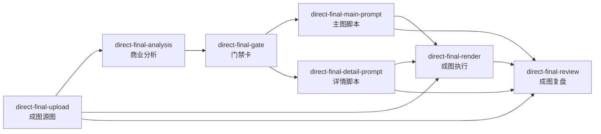

# PinCanvas 成图直出完整流程功能文档

## 文档目的

本文说明 PinCanvas 新增 `direct-final` 模块的完整功能流程，依据当前代码结构和实现行为编写。它用于产品确认、开发维护、测试用例设计和后续迭代交接。

主要覆盖：

- 从商品源图上传到最终电商图生成、复盘的用户路径。
- 七类 direct-final 节点的职责、输入、输出、状态保存方式。
- 结构化 LLM、图片生成、本地自审、AI 复盘的执行规则。
- 连线关系、上游数据读取、失败条件和当前边界。

相关实现入口：

- `src/types/direct-final.ts`
- `src/types/node.ts`
- `src/api/structured.ts`
- `src/lib/direct-final/sourceImages.ts`
- `src/lib/direct-final/prompts.ts`
- `src/lib/direct-final/validation.ts`
- `src/lib/direct-final/compliance.ts`
- `src/lib/direct-final/review.ts`
- `src/lib/direct-final/graph.ts`
- `src/canvas/nodes/DirectFinalNodes.tsx`
- `src/hooks/useGenerationTrigger.ts`
- `src/hooks/useUpstream.ts`
- `src/canvas/factory.ts`
- `src/canvas/Canvas.tsx`
- `src/components/AddNodeMenu.tsx`

## 当前范围

当前版本把 `flow/src/modules/direct-final` 的核心能力迁到 PinCanvas 画布节点链路中。它没有照搬 flow 的 Next.js 页面、项目 JSON 文件存储、executor run/output 实体，也没有引入独立后端证据链。

状态保存在：

- 节点 `settings`：商业分析、门禁卡、脚本、模型配置、复盘结果、错误信息。
- 节点 `content`：成图执行节点的当前主结果图。
- 节点 `generatedImages`：成图执行节点的候选结果图数组。
- PinCanvas 现有 IDB 快照：保存画布节点和连线。
- 历史记录：保存 direct-final render 的图片生成历史。

当前已经实现：

- 可见节点流程。
- 商品源图上传和角色标记。
- 商业分析结构化生成、编辑、确认和源图变化提示。
- 门禁卡结构化生成、编辑、确认。
- 主图和详情图脚本结构化生成。
- 脚本本地自审评分。
- 成图执行 prompt 拼装和图片生成。
- AI 复盘评分。

当前没有实现：

- 复盘后自动重写脚本。
- 脚本自审后的自动阻断或自动修稿。
- flow 的项目文件 JSON 存储。
- flow 的 run/output 证据链实体。

## 总流程



典型操作路径：

1. 在节点库选择“电商成图”下的“成图直出模板”。
2. 模板创建 1 个 `direct-final-upload` 和 1 个 `direct-final-analysis`，并自动连线。
3. 用户在上传节点放入商品源图，可填写图片角色。
4. 用户在分析节点选择 chat 模型，点击“生成”，得到 `CommercialBrief`。
5. 用户编辑并确认商业分析。
6. 用户点击“生成门禁”，分析节点生成 3 到 5 个门禁节点，并横向展开。
7. 用户逐个编辑并确认门禁卡。
8. 用户在门禁节点选择主图数量和详情模块，点击“创建链路”。
9. 门禁节点创建 prompt、render、review 三段节点，并自动连接源图。
10. 用户在 prompt 节点生成主图脚本或详情脚本。
11. 用户在 render 节点生成最终图。
12. 用户在 review 节点执行 AI 复盘。

## 节点类型

### direct-final-upload

职责：承载商品源图，给后续商业分析、成图执行、复盘提供真实参考图。

用户能力：

- 点击选择图片。
- 拖入图片。
- 查看图片预览。
- 填写图片角色，例如包装、内容物、细节。

保存字段：

- `settings.content`：图片 data URL。
- `settings.filename`：文件名。
- `settings.width`、`settings.height`：图片尺寸。
- `settings.roleName`：用户填写的角色名称。

输出规则：

- 作为 direct-final 源图参与上游读取。
- `sourceImages.ts` 会按文件名或 `roleName` 推断角色：`package`、`contents`、`detail`、`general`。
- 最多向 direct-final 流程收集 3 张源图。

### direct-final-analysis

职责：基于源图生成商业输入 `CommercialBrief`，并在确认后生成门禁节点。

用户能力：

- 选择 chat 模型。
- 点击“生成”生成商业分析草稿。
- 编辑品牌、公司、产品类型、SKU、主图文案、人群和市场信息。
- 查看缺失字段提示。
- 确认商业分析。
- 在确认后点击“生成门禁”。

主要保存字段：

- `settings.model`
- `settings.copyLanguage`
- `settings.brief`
- `settings.risk`
- `settings.action`
- `settings.gateCount`
- `settings.isGenerating`
- `settings.error`

生成商业分析时：

- 调用 `requestStructuredJson`。
- 使用 `buildCommercialBriefInstructions` 和 `buildCommercialBriefInputText`。
- 使用 `COMMERCIAL_BRIEF_SCHEMA`。
- 把源图作为多模态输入传给模型。
- 结果通过 `createCommercialBriefFromPayload` 归一化。
- 同时通过 `buildRiskSummary` 生成风险摘要。

确认商业分析时：

- 调用 `normalizeCommercialBriefForSave`。
- 写入 `confirmedAt`。
- 重算 `missingFields`。
- 保存源图快照 `sourceSnapshot.imageIds`。
- 清除过期状态。
- 重算风险摘要。

源图变化时：

- 节点组件调用 `refreshCommercialBriefStale`。
- 如果当前源图 ID 列表和确认时快照不同，设置 `isStale: true`。
- `staleSignals` 写入 `source_image_changed`。
- UI 显示“源图发生变化，请重新生成或确认沿用”。

生成门禁时：

- 必须已有 `brief.confirmedAt`。
- `brief.isStale` 必须为 false。
- 调用 `requestStructuredJson` 生成 `SellingReasonCard` 列表。
- 使用 `SELLING_REASON_SCHEMA`。
- 少于 3 张门禁卡时失败。
- 生成的门禁节点从分析节点右侧横向展开。
- 自动添加 `analysis -> gate` 连线。

### direct-final-gate

职责：承载一张必卖理由卡 `SellingReasonCard`，确认后创建后续脚本、成图和复盘链路。

用户能力：

- 编辑目标人群、痛点、方案、利益翻译、场景偏好、信任证据。
- 点击“确认门禁”。
- 设置主图数量，范围 0 到 5。
- 勾选详情模块，默认 M1、M2、M3、M4、M6、M7。
- 点击“创建链路”。

主要保存字段：

- `settings.card`
- `settings.mainPromptCount`
- `settings.detailModules`
- `settings.isGenerating`
- `settings.error`

确认门禁时：

- 调用 `normalizeSellingReasonForSave`。
- 写入 `confirmedAt`。
- 标记 `hasManualEdits: true`。

创建链路时：

- 必须先确认门禁。
- 每个主图数量生成一个 `direct-final-main-prompt`。
- 每个选中的详情模块生成一个 `direct-final-detail-prompt`。
- 每个 prompt 后面都创建一个 `direct-final-render` 和一个 `direct-final-review`。
- 自动连线：
  - `gate -> prompt`
  - `prompt -> render`
  - `render -> review`
  - `prompt -> review`
  - `source -> render`
  - `source -> review`
- 详情图 render 默认设置为 3:4，尺寸 768x1024。

### direct-final-main-prompt

职责：生成单张主图的结构化成图脚本 `DirectFinalAsset`。

用户能力：

- 选择 chat 模型。
- 选择主图 slot。
- 点击“生成脚本”。
- 查看目标、画面、图内文案、设计备注、合规备注、本地自审分数。

主图 slot：

| slot | 目标 |
| --- | --- |
| 1 | 首图点击率核心 |
| 2 | 痛点共鸣 |
| 3 | 差异化优势 |
| 4 | 场景适配 |
| 5 | CTA 行动号召 |

主要保存字段：

- `settings.model`
- `settings.copyLanguage`
- `settings.slot`
- `settings.asset`
- `settings.isGenerating`
- `settings.error`

生成前置条件：

- 上游商业分析已确认。
- 商业分析未过期。
- 存在源图。
- 存在已确认门禁卡。

生成规则：

- 使用 `buildAssetInstructions` 和 `buildAssetInputText`。
- 使用 `DIRECT_FINAL_ASSET_SCHEMA`。
- 结构化结果通过 `createAssetFromPayload` 归一化。
- 使用 `evaluateDirectFinalAsset` 计算本地自审分数。
- 分数写入 `asset.selfReviewScore`。

### direct-final-detail-prompt

职责：生成单张详情模块的结构化成图脚本 `DirectFinalAsset`。

用户能力：

- 选择 chat 模型。
- 选择详情模块 M1 到 M8。
- 点击“生成脚本”。
- 查看结构化脚本摘要和本地自审分数。

详情模块：

| code | 目标 |
| --- | --- |
| M1 | 首屏痛点共鸣 |
| M2 | 核心优势展开 |
| M3 | 配方/工艺深度 |
| M4 | 使用场景 |
| M5 | 品牌/资质信任 |
| M6 | 规格参数 + 竞品对比 |
| M7 | FAQ |
| M8 | 购买引导 + 法律声明 |

生成前置条件和主图 prompt 相同。

详情脚本的执行偏向：

- `prompts.ts` 要求详情模块适配 3:4 竖版详情页。
- 门禁创建链路时，详情 render 默认使用 `ratio: 3:4`、`resolution: 768x1024`。

### direct-final-render

职责：把已生成的 `DirectFinalAsset` 拼成英文执行 prompt，调用现有图片生成链路，得到最终图。

用户能力：

- 选择图片模型。
- 设置比例和分辨率。
- 点击“生成图”。
- 查看生成结果。
- 查看错误信息。

主要保存字段：

- 节点 `content`：当前主结果图。
- 节点 `generatedImages`：全部候选图。
- `settings.model`
- `settings.copyLanguage`
- `settings.ratio`
- `settings.resolution`
- `settings.width`
- `settings.height`
- `settings.quality`
- `settings.count`
- `settings.prompt`
- `settings.isGenerating`
- `settings.error`

生成前置条件：

- 存在商业分析。
- 商业分析已确认。
- 商业分析未过期。
- 存在 prompt 节点脚本 `asset`。
- 至少连接 1 张源图。

执行规则：

- 使用 `collectDirectFinalGraphContext` 读取上游商业分析、门禁、脚本、源图。
- 使用 `buildDirectFinalExecutionPrompt` 生成最终英文执行 prompt。
- prompt 包含：
  - 商品保真要求。
  - 图内文字 `textBlocks`。
  - 布局提示 `layoutHints`。
  - 图层计划 `layerPlan`。
  - 合规备注。
  - 负面约束 `negativeConstraints`。
- 非 Midjourney 模型走现有 `generateImage`。
- Midjourney 模型走 `mjImagine`，并尝试 `splitMjGrid`。
- 生成结果通过 `persistImageUrls` 保存。
- 结果写回当前 render 节点，不自动创建 image-compare 节点。
- render 仍会进入生成历史记录。

### direct-final-review

职责：读取源图、结果图和对应脚本，调用结构化 LLM 输出成图复盘评分。

用户能力：

- 选择 chat 模型。
- 点击“AI 复盘”。
- 查看 6 维评分。
- 查看复盘摘要。
- 查看具体问题。

主要保存字段：

- `settings.model`
- `settings.copyLanguage`
- `settings.review`
- `settings.isGenerating`
- `settings.error`

复盘前置条件：

- 存在商业分析。
- 存在 prompt 节点和脚本 `asset`。
- 存在 render 节点结果图 `content`。
- 至少连接 1 张源图。

评分维度：

- 图内文字渲染。
- 文案可读性。
- 目标对齐。
- 合规保留。
- 成品感。
- 商品保真。

复盘调用：

- 使用 `buildReviewInstructions` 和 `buildReviewInputText`。
- 使用 `DIRECT_FINAL_REVIEW_SCHEMA`。
- 多模态输入顺序为：源图在前，结果图在后。
- 输出通过 `createReviewFromPayload` 归一化。

## 核心数据对象

### DirectFinalSourceImage

表示 direct-final 流程里的源图摘要。

关键字段：

- `imageId`
- `nodeId`
- `filename`
- `roleName`
- `role`
- `roleLabel`
- `shortRoleLabel`
- `width`
- `height`
- `url`

来源节点：

- `direct-final-upload`
- `input-image`

当前收集上限为 3 张。

### CommercialBrief

表示商业输入草稿和确认结果。

关键字段：

- `productType`
- `brandName`
- `companyName`
- `skuList`
- `priceInfo`
- `copyDraft`
- `targetAudienceNotes`
- `competitiveRefs`
- `marketNotes`
- `missingFields`
- `confirmedAt`
- `isStale`
- `staleSignals`
- `sourceSnapshot`

产品类型：

- `food`
- `blue-cap-health`
- `sports`
- `other`

### SellingReasonCard

表示一张门禁卡。

关键字段：

- `sellingReasonId`
- `targetAudience`
- `painPoint`
- `solution`
- `benefitTranslation`
- `trustEvidence`
- `priority`
- `scenePreference`
- `applicableModules`
- `confirmedAt`

### DirectFinalAsset

表示一张主图或详情图的成图脚本。

关键字段：

- `assetId`
- `assetKind`
- `mainImageSlot`
- `detailModuleCode`
- `goal`
- `visualContent`
- `inImageCopy`
- `textBlocks`
- `layoutHints`
- `layerPlan`
- `designNotes`
- `negativeConstraints`
- `complianceNotes`
- `selfReviewScore`
- `originSellingReasonIds`

### DirectFinalReview

表示 AI 成图复盘结果。

关键字段：

- `reviewId`
- `outputNodeId`
- `promptNodeId`
- `assetId`
- `scoreInImageCopyRendered`
- `scoreCopyReadability`
- `scoreCopyGoalAlignment`
- `scoreComplianceRetained`
- `scoreFinishedLook`
- `scoreProductFidelity`
- `aiSummary`
- `issues`

### DirectFinalRiskSummary

表示商业输入和源图组合带来的执行风险。

风险信号包括：

- `packagingDenseText`
- `multipleLogosOrBadges`
- `verticalTextOrComplexTable`
- `highSkuCount`
- `manyComplianceMarks`
- `manyMissingCommercialFields`

风险等级：

- `low`
- `medium`
- `high`

## 结构化 LLM 调用

结构化生成由 `src/api/structured.ts` 提供。

请求优先级：

1. 请求 `/v1/responses`，使用 `text.format.type: json_schema`。
2. 如果 `/responses` 返回 404、405、501，改用 `/v1/chat/completions`。
3. chat completions 优先使用 `response_format.type: json_schema`。
4. 如果 schema 格式不支持，改用 `response_format.type: json_object`。
5. 返回内容解析失败时，尝试解析：
   - 纯 JSON。
   - Markdown 代码块 JSON。
   - 文本中的第一个完整 JSON 对象。

使用结构化生成的节点：

- `direct-final-analysis` 生成 `CommercialBrief`。
- `direct-final-analysis` 生成 `SellingReasonCard[]`。
- `direct-final-main-prompt` 生成主图 `DirectFinalAsset`。
- `direct-final-detail-prompt` 生成详情 `DirectFinalAsset`。
- `direct-final-review` 生成 `DirectFinalReview`。

## 上游读取和连线规则

direct-final 的上下文读取由 `collectDirectFinalGraphContext` 完成。

它会从当前节点向上游递归收集：

- 源图 `sourceImages`。
- 分析节点 `analysisNode`。
- 商业输入 `brief`。
- 风险摘要 `risk`。
- 门禁节点 `gateNodes`。
- 门禁卡 `cards`。
- prompt 节点 `promptNode`。
- 脚本 `asset`。
- render 节点 `renderNode`。

画布连线规则：

- `direct-final-render` 只接受图片源节点或 direct-final prompt 节点作为上游。
- 图片源节点包括 `input-image`、`direct-final-upload`、已有结果的 `gen-image`、已有结果的 `direct-final-render`、`image-compare`、`preview`。
- direct-final prompt 节点包括 `direct-final-main-prompt` 和 `direct-final-detail-prompt`。
- store 的 `addEdge` 会跳过重复的 `from -> to` 连线。
- 删除节点时，store 会删除与该节点相关的连线。

`useUpstream` 也识别：

- `direct-final-upload` 作为参考图来源。
- `direct-final-render.content` 作为下游参考图来源。

## 本地校验和合规规则

校验集中在 `src/lib/direct-final/validation.ts`、`compliance.ts`、`review.ts`。

商业分析校验：

- 归一化产品类型。
- 清理字符串字段。
- 计算缺失字段。
- 保存源图快照。
- 检测源图变化。

门禁卡校验：

- 归一化优先级，范围 1 到 5。
- 清理字符串列表。
- 保存确认时间。

脚本校验：

- 归一化 `textBlocks`、`layoutHints`、`layerPlan`。
- 将 `originSellingReasonIds` 限制在已确认门禁卡范围内。
- 如果模型没有返回有效门禁 ID，则回填当前已确认门禁卡 ID。

合规规则：

- 通用品类：拦截绝对化或无法证明的承诺。
- 普通食品：拦截功效或治疗暗示。
- 蓝帽保健食品：拦截医疗或治疗表述。
- 运动器材：拦截医疗化表述。
- 所有脚本：检查 `negativeConstraints` 是否包含 logo、包装、认证、材质、结构等保真约束。

本地自审评分：

- 主图图内文案上限为 5 行。
- 详情模块图内文案上限为 6 行。
- 评分维度为精简度、图内可放性、合规性、结构清晰度、实用性。
- 低于要求时写入 `violations`。
- 存在严重合规问题时写入 `criticalViolations`。
- prompt 生成完成后，分数写入 `asset.selfReviewScore`。

## 失败条件和用户提示

商业分析：

- 未连接源图时，生成按钮禁用并显示“请先连接成图源图节点”。
- 模型不存在时，任务失败并写入错误。
- 上游结构化结果无法解析时，任务失败并写入错误。

生成门禁：

- 商业分析未确认，失败提示“先确认商业分析，再生成门禁节点”。
- 商业分析已过期，失败提示“商业分析已过期，请重新确认后再生成门禁节点”。
- 门禁数量少于 3，失败提示“门禁节点数量不足 3 个”。

生成脚本：

- 商业分析未确认，失败提示“先确认商业分析，再生成成图脚本”。
- 商业分析已过期，失败提示“商业分析已过期，请重新确认”。
- 缺少源图，失败提示“缺少源图”。
- 没有已确认门禁卡，失败提示“先确认门禁节点，再生成成图脚本”。

成图执行：

- 缺少商业分析，失败提示“缺少商业分析”。
- 商业分析未确认，失败提示“先确认商业分析，再生成最终图”。
- 商业分析已过期，失败提示“商业分析已过期，请重新确认”。
- 缺少成图脚本，失败提示“缺少 direct-final 成图脚本”。
- 缺少源图，失败提示“缺少源图”。
- 图片生成没有返回 URL 或 base64 时，失败提示“生成结果无 url / b64_json”。
- 结果持久化失败时，失败提示“生成结果持久化失败”。

AI 复盘：

- 缺少商业分析，失败提示“缺少商业分析”。
- 缺少成图脚本，失败提示“缺少成图脚本”。
- 缺少成图结果，失败提示“缺少成图结果”。
- 缺少源图，失败提示“缺少源图”。

## 节点库和模板

`AddNodeMenu` 增加了“电商成图”分组。

分组内包含：

- 成图直出模板。
- 成图源图。
- 商业分析。
- 门禁。
- 主图脚本。
- 详情脚本。
- 成图执行。
- 成图复盘。

当前模板行为：

- 创建 1 个 `direct-final-upload`。
- 创建 1 个 `direct-final-analysis`。
- 添加 `upload -> analysis` 连线。
- 选中这两个节点。

当前模板不预创建空白门禁、空白脚本、空白成图和空白复盘节点。后续节点由分析节点和门禁节点按用户确认结果创建。

## 测试覆盖建议

当前新增测试重点覆盖：

- `parseJsonOutput`：纯 JSON、代码块 JSON、文本内 JSON、非 JSON。
- `sourceImages`：角色识别、最多 3 张源图、用户角色名。
- `compliance`：绝对化表达、普通食品功效暗示、保真约束缺失。
- `validation`：商业分析缺失字段、门禁优先级、脚本卖点 ID、风险信号、分数限制。
- `review`：主图 5 行限制、卖点关联、本地自审分数。
- `prompts`：执行 prompt 是否包含保真、图内文字、布局、层级和负面约束。
- `useUpstream`：direct-final 上传图和 render 结果作为参考图。
- `canvas store`：重复连线不增加，删除节点后清理关联连线。

建议手动验证路径：

1. 新建成图直出模板。
2. 上传 1 到 3 张商品源图，填写不同角色。
3. 生成商业分析，编辑后确认。
4. 生成门禁节点，确认至少 1 张门禁。
5. 从门禁创建主图和详情链路。
6. 生成主图脚本和详情脚本。
7. 在 render 节点生成图片。
8. 在 review 节点执行 AI 复盘。
9. 替换源图，确认商业分析出现过期提示。

建议命令验证：

```bash
npm run typecheck
npm run test:run
npm run build
```

## 迭代边界

后续可扩展方向：

- 复盘后自动生成改稿建议并写回 prompt 节点草稿。
- 本地自审分数低于阈值时阻止成图执行。
- 批量生成多个 render 节点。
- 更细的源图角色配置，例如包装正面、包装背面、内容物、场景图。
- 对高风险字段加入人工确认记录。
- 为 direct-final review 增加人工确认状态。

当前版本的核心目标是保持所有中间产物都成为画布上的真实节点，让用户可以看见、编辑、连线、重跑和复盘。
